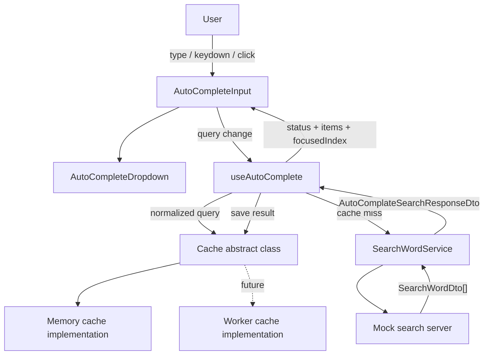
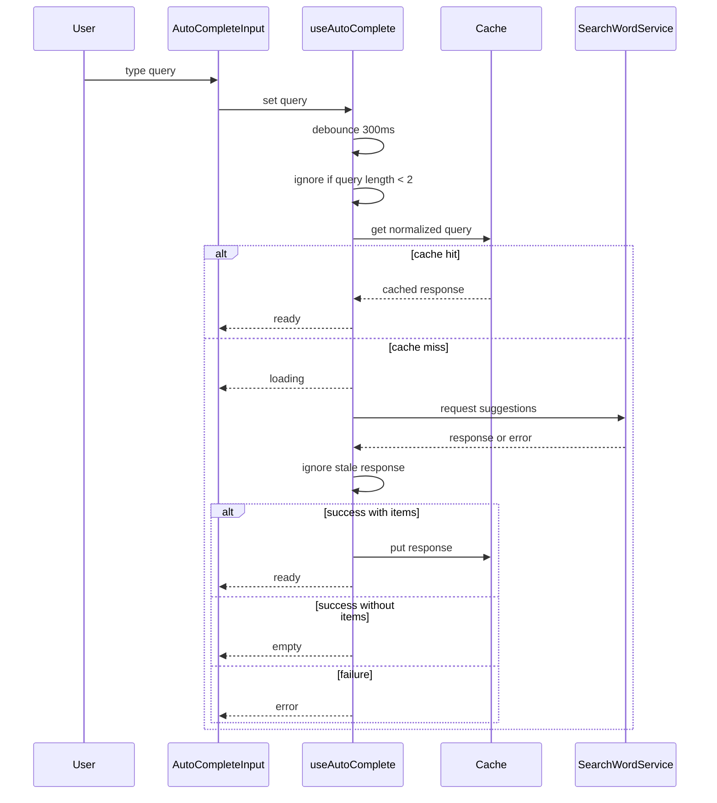
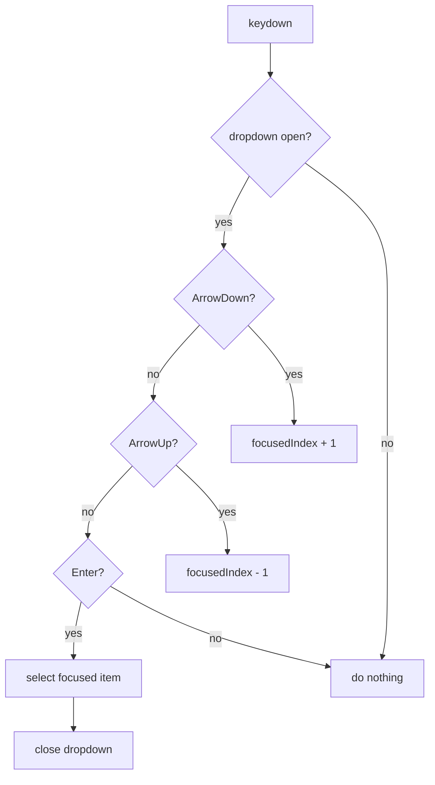

## RADIO 방식의 컴포넌트 설계 - 자동 검색어 추천 검색창

### Requirement

구현하고자 하는 컴포넌트는 자동 검색 완성 INPUT 

- 사용자가 텍스트를 입력하면 Input 아래 위치에 추천 검색어 목록이 노출된다.
- 사용자는 해당 검색어를 마우스로 선택 및 클릭하면 해당 검색어로 검색이 된다. (다만 현재 구현과정에서는 검색어 state 를 선택한 state 로 변경하는것으로만 마무리 한다)
- 검색어 추천은 2글자 이상이 되면 나타나도록 한다
- 검색어 추천목록은 스크롤이 가능하다
- 추천검색어에서 검색어가 겹치는 부분은 굵게 표시한다.
- 검색어가 focus 되는 상황은 마우스 호버, 키보드 focus 시 이루어지며, focus 시 배경색이 다른 색으로 변경된다
- 키보드를 이용한 검색어 선택은 화살표 위아래를 이용하여 이동하고, 엔터를 입력하면 선택된다.
- 추천검색어를 가져오는 과정에서의 Loading 화면이 필요
- 추천검색어를 가져오지 못하거나 검색 결과가 없을 때의 화면도 필요
- 검색 실패에도 검색창은 계속 사용할 수 있어야 한다

### Architecture

설계를 할 때 고려되어야 할 점은 다음과 같다.

- 검색어의 경우 비동기적 서버 요청이다
    - 이에 따라 과도한 호출을 방지하기 위한 debounce 설계가 필요
    - race condition 을 고려하여 가장 최종적으로 완성한 결과물을 띄어줘야 함
    - 같은 결과를 계속 호출하는것은 낭비이니 내부 cache 처리르 통해 cache 값이 존재한다면 cache 값을 바로 보여준다. cache 는 서버에서 처리하는것이 적합하지만, 현재로서는 해당 cache 가 client 내에서 처리되어야 한다는 조건을 가지도록 한다.
- 검색어를 타이핑 하는것이 아니라, 마우스 혹은 키보드 엔터 선택 시 api 요청을 진행하지 않음. 또한 자동 완성 검색어 목록 창 역시 닫힌다.
- 검색어 요청은 UI 입력 흐름과 분리한다.
    - Input 은 query 를 관리한다.
    - debounce 이후의 요청 실행은 hook 또는 service 에 위임한다.
    - 응답 DTO 는 UI 에서 바로 쓰지 않고 RecommendWord 로 변환한다.
- dropdown 상태는 요청 상태와 결과 상태를 함께 표현한다.
    - loading: 요청 진행 중
    - ready: 추천 결과 존재
    - empty: 요청은 성공했지만 추천 결과 없음
    - error: 요청 실패
- focus 상태는 mouse hover 와 keyboard navigation 이 같은 값을 바라보도록 한다.
    - focusedIndex 를 기준으로 현재 focus 된 추천어를 계산한다.
    - mouse enter 시 focusedIndex 를 갱신한다.
    - arrow up/down 시 focusedIndex 를 갱신한다.
- 선택 이벤트는 검색 이벤트와 다르게 처리한다.
    - 추천어 선택 시 query 를 선택된 value 로 변경한다.
    - dropdown 을 닫는다.
    - 선택으로 인한 query 변경은 debounce 요청을 발생시키지 않는다.
- cache 는 추상 클래스 뒤에 숨긴다.
    - 현재 구현은 memory cache 로 시작할 수 있다.
    - 이후 Web Worker 기반 cache 로 바꿔도 UI 와 service 호출부는 유지한다.
    - cache key 는 trim/lowercase 처리한 query 를 사용한다.
- mock server 는 실제 서버 경계를 흉내낸다.
    - Promise 기반으로 응답한다.
    - setTimeout 으로 latency 를 만든다.
    - 특정 query 에서는 실패를 발생시켜 error 상태를 확인한다.
    - 결과가 없는 query 는 empty 상태를 확인하는 데 사용한다.

```
search -> user input -> debounce -> cache check -> server call -> race condition check -> get results -> save cache -> show results

```

### Mermaid

#### Component Structure



#### Request Flow



#### Keyboard Selection Flow



### Data Model

- SearchWord: UI 표현될 검색어 데이터, 검색어 및 하이라이트
- SearchWordDto: 서버에서 전달해주는 검색어 데이터
- AutoComplateSearchResponseDto: 서버에서 전달해주는 총 자동 추천 검색어 리스트
- 검색어 dropdown: 추천 검색어 목록, 로딩, 에러 상태, 빈 상태에 대한 화면
- 검색어 Input: 입력값

### Interface

```typescript
interface SearchWordDto {
    id: string;
    value: string;
}

interface AutoComplateSearchResponseDto {
    total: number;
    items: SearchWordDto[];
}

interface CacheValue<T> {
    value: T;
    createdAt: number;
    ttl: number;
}

abstract class Cache<T>{
    private static instance: Cache<T>;
    private cache: Map<string, CacheValue<T>> = new Map();

    private constructor() {}

    static getInstance(): Cache<T> {}

    static put(key: string, value: T): void {}

    static get(key: string): T | null {}

    static delete(key: string): void {}

    static clear(): void {}
}

// ui

interface RecommendWord {
    id: string;
    value: string;
    matchedIndices: number[]; // 굵게 표시할 부분
    isFocused: boolean;
}

type AutoCompleteState = 'loading' | 'ready' | 'empty' | 'error'

interface AutoCompleteDropdownProps {
    totalCount: number;
    items: RecommendWord[];
    state: AutoCompleteState
    search: (query: string) => void;
}


```

### Folder Structure

```text
auto-complete-input/
  architecture.md
  services/
    mockWords.ts
    searchWordService.ts
    cache/
      Cache.ts
      MemoryCache.ts
      WorkerCache.ts
      cacheWorker.ts
  hooks/
    useAutoComplete.ts
  ui/
    AutoCompleteInput.tsx
    AutoCompleteDropdown.tsx
    AutoCompleteOption.tsx
  utils/
    normalizeQuery.ts
    createMatchedIndices.ts
```

- `services/mockWords.ts`: mock server 가 사용할 단어 목록
- `services/searchWordService.ts`: mock 서버 요청을 Promise 로 감싸는 계층
- `services/cache/Cache.ts`: cache 추상 클래스와 공통 타입
- `services/cache/MemoryCache.ts`: 현재 실습에서 사용할 기본 cache 구현
- `services/cache/WorkerCache.ts`: Web Worker 기반 cache 로 교체할 때 사용할 구현
- `services/cache/cacheWorker.ts`: Worker 내부에서 Map 을 들고 메시지를 처리하는 파일
- `hooks/useAutoComplete.ts`: debounce, 요청 상태, race condition, cache hit/miss 처리
- `ui/AutoCompleteInput.tsx`: input 과 전체 조합
- `ui/AutoCompleteDropdown.tsx`: 상태별 dropdown 렌더링
- `ui/AutoCompleteOption.tsx`: 추천어 한 줄과 highlight 렌더링
- `utils/normalizeQuery.ts`: query trim/lowercase 처리
- `utils/createMatchedIndices.ts`: 추천어에서 query 와 일치하는 위치 계산

처음 구현에서는 `AutoCompleteInput.tsx`, `mockWords.ts`, `searchWordService.ts`, `Cache.ts`, `MemoryCache.ts` 정도만 시작해도 된다. Worker cache 와 세부 UI 분리는 컴포넌트가 커졌을 때 추가한다.

### Optimization

성능 지표로서

- time to first suggestion 
- suggestion api latency 
- suggestion api error rate 
- cache hit rate 
- drop off rate 
- search conversion rate
