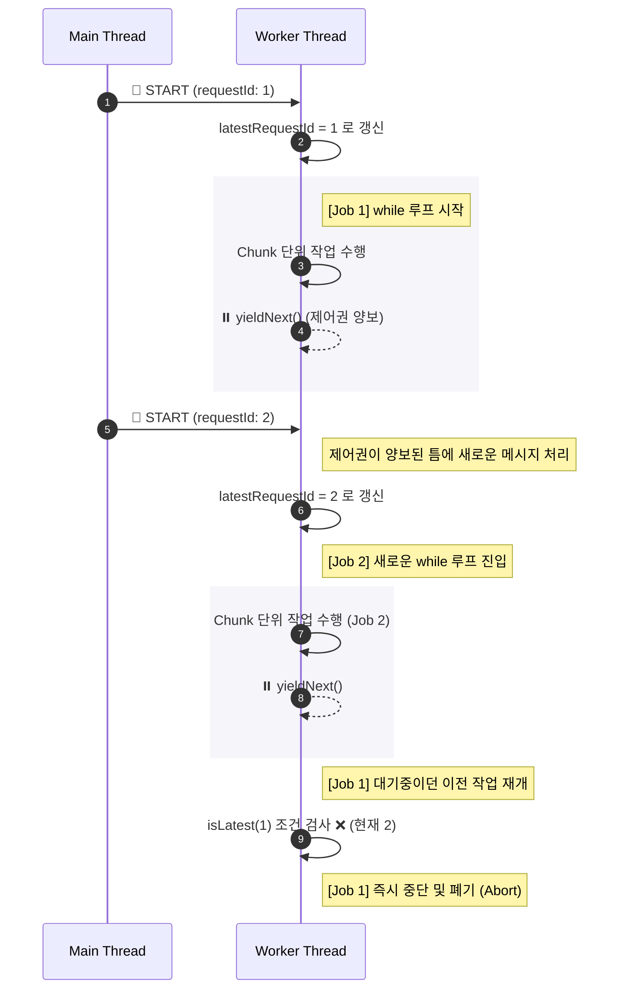
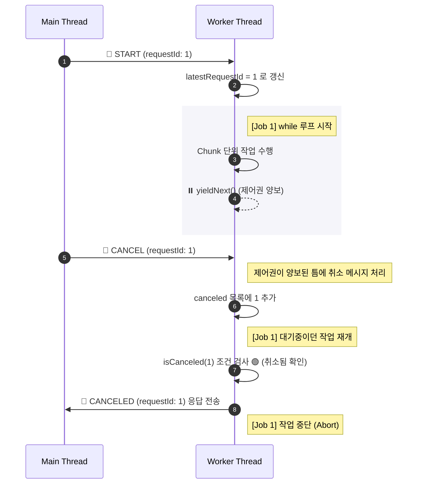

# LAB - Web Worker

## 실험 목적

자바스크립트의 싱글 스레드의 한계점과 브라우저 환경에서의 worker thread 활용법을 실습해보기 위함
이를 기반으로 좀 더 browser 내 worker 의 사용법과 한계점들에 대해서도 더 깊게 이해하기 위함

## 차례

### 1. worker-cancel

#### worker 의 작업을 중간에 취소하기

worker 에 message 를 전달하게 되면, worker 는 전달받은 message 를 기반으로 (type 등을 판별) 작업을 수행한다.

보통 worker 에서의 작업은 작업 시간이 길게 걸리는 작업들을 메인스레드에서 처리하기 적절하지 않아 대신 백그라운드에서 처리할 수 있도록 하는것인데, 사용자는 이러한 긴 작업을 중간에 취소하고 새로운 요청의 작업을 진행하고 싶을 수 있다.

다만 worker 의 스레드와 main 스레드는 다른 스레드이기 때문에, 작업에 간섭하기 위해서는 좀 더 특별한 방식이 필요하다.

#### 개념적 접근

흔히 사용자가 검색어를 기입하는 순간, message 가 변경된 job 을 worker 에게 전달하는데, 이미 worker 는 이전에 보낸 job 에 대한 작업을 수행중이다.

이러한 흐름에 간섭하기 위해서 MessageChannel 을 통해 worker thread 의 작업을 잠시 멈출수 있도록 한다.

**새로운 작업 자동 등록**

- main thread 에서 job 요청을 message 로 worker 에 전달
- worker 는 전달받은 message 의 requestId 를 latestRequestId 에 기록해놓는다.
- 이후 worker 는 while문 기반으로 chunk 단위로 작업을 진행한다. 
- 작업 중간 main thread 내에서 job 요청이 들어오게 됨 (새로운 requestId)
- worker 에서는 latestRequestId 를 새로운 requestId 로 변경해놓는다.
- worker 의 while 문 조건에 따라 현재 진행중인 requestId 가 새로 들어온 requestId 와 다르다면 작업을 중단시킨다
- 이후 다시 while 문으로 진입하여 작업을 진행 



**사용자의 요청에 따른 cancel**

- main thread 에서 cancel 요청을 message 로 worker 에 전달하는데, 현 작업중인 requestId 까지 같이 전송
- worker 는 전달받은 requestId 를 canceled 에 기록해놓고, 이후 while 문의 조건에 따라 작업을 중단시킨다



**yield**

중간에 개입해서 작업을 종료하고 다시 하면 된다고 생각하기 쉽지만, 사실 이미 스레드 내에서 실행되는 작업을 중간에 개입하는것은 쉽지 않다. 

동기적으로 실행되는 코드는 실행이 끝나기 전까지는 다른 작업을 할 수 없기 때문인데, 예를 들어 for 순회가 전체 데이터 10만개에 해당하여 실행중이라고 한다면 해당 루프 내 중단점이 없다면 계속해서 실행이 될 것이고, main 스레드에서 중단 요청을 보냈어도 worker 스레드에서는 계속해서 순회를 진행중일 것이다.

따라서 작업을 chunk 단위로 끊어서 작업할 수 있도록 하고, 매 chunk 가 끝날 때 마다 다른 함수가 호출 될 기회를 얻을 수 있도록 해야한다.

가장 확실한 방법은 실행중인 함수를 microTaskQueue 로 이동시키는 것인데, 이것은 결국 내부에서 Promise 처리를 해주어야 한다. MessageChannel 은 이를 위한 좋은 선택이다.

```typescript

// 중단점을 만드는 방식
const createMessageChannelYield = () => {
    const channel = new MessageChannel();

    const resume: () => void | null = null;

    channel.port1.onmessage = () => {
        const r = resume;
        resume = null
        r?.();
    }

    return function yieldNext() {
        return new Promise<void>((resolve) => {
            resume = resolve;
            channel.port2.postMessage(null);
        })
    }
}

// worker 내부 실행 함수
function runFilterJob(props: Props) {
    // .. props 로 yieldNext 를 전달받았다 가정

    // chunk 단위가 전체에 도달하지 않았다면
    while (processed < totalItems) {
        // 최신이 아니라면 중단
        if (!this.isLatest(requestId)) {
            return;
        }

        // 취소되었다면 중단
        if (this.isCanceled(requestId)) {
            post({ type: "CANCELED", requestId });
            return;
        }

        const end = Math.min(processed + config.chunkIterations, totalItems)

        // chunk 단위 연산
        for (let i = processed; i < end; i++) {
            if (items[i]?.toLocaleLowerCase().includes(q)) {
                indices.push(i)
            }
            if (config.maxResults && indices.length >= config.maxResults) {
                processed = totalItems; // 전체 종료처럼 처리
                break;
            }

            // CPU 부하(선택): “계산이 무거운 상황” 재현
            // totalIterations는 chunk마다 나눠서 조금씩 돌림
            if (config.totalIterations > 0) {
                for (let j = 0; j < config.totalIterations; j++) {
                    cpu += (j % 10);
                }
            }

            // 다음 chunk 를 위한 값 갱신
            processed = end;
            chunkCount++;

            // progress는 너무 자주 보내면 메인 렌더가 오히려 흔들릴 수 있음
            if (chunkCount % config.progressEveryChunks === 0) {
                post({ type: "PROGRESS", requestId, done: processed, total: totalItems });
            }

            // ✅ yield: 다음 tick으로 양보 → 메시지 처리(START/CANCEL) 기회 확보
            await yieldNext();
        }
}

```

중요부분은 await yieldNext() 부분인데, 해당 호출로 인해 runFilterJob 의 함수가 worker 스레드에서 잠시 양보되어지게 되는데, 작업 이전 main 스레드에서 중단요청이던 새로운 요청이 들어오게 되면, 해당 요청에 대한 처리가 worker 스레드에서 먼저 실행 컨텍스트내 실행이 진행되게 된다. 

예를 들어 취소라고 한다면, requestId를 취소 set 에 추가시키게 되고, 이후 다시 runFilterJob 실행 시 초기 조건에 따라 실행이 취소가 되는 것이다.

**yield 의 간격은?**

애매하긴 하다. 사실 chunk 의 간격이라 하는것이 맞는데, chunk 의 간격이 너무 짧다면, 그만큼 작업 시간이 더 길어지게 되고, 너무 길다면 중간 개입이 쉬워지지 않는다. 

보통 chunk 단위는 브라우저 내 rAF 의 실행 간격하고도 밀접하게 관계가 있는데, 그래서인지 총 작업시간이 16ms 를 넘지 않는 선에서 처리하는것이 좋아보인다.

### 2. worker-cancel-in-abort

#### 개념적 접근

이전 테스트와 큰 차이는 나지 않는데, 이전 테스트는 메인 스레드의 취소요청을 worker 스레드에서 받아서 처리하는것이였다면, 이번에도 마찬가지지만 차이점이라면 네트워크 요청도 같이 종료시킨다는 측면에 있다.

AbortController 를 활용한 방식이지만, 결국은 기존 테스트에서 네트워킹 요청에 대한 취소까지 추가한 버전이라고 생각하면 된다. 그래서 테스트 코드도 기존과 동일하면서도 네트워크 요청만 추가됬다고 생각하면 된다.

#### 예제 코드

```typescript
    async function runSearch(nextQuery: string) {
        if (!workerRef.current) return;

        const id = ++requestIdRef.current;
        latestIdRef.current = id;

        // 이전 네트워크 요청 취소
        if (abortRef.current) abortRef.current.abort();
        const ac = new AbortController();
        abortRef.current = ac;

        // 이전 worker 작업도 취소
        if (id > 1) {
            const prev = id - 1;
            const cancelMsg: ToWorker = { type: "CANCEL", requestId: prev };
            workerRef.current.postMessage(cancelMsg);
        }

        setStatus(`Fetching... id=${id}`);

        try {
            const t0 = performance.now();
            const { list, delayMs } = await fakeSearchApi({ query: nextQuery, signal: ac.signal });
            const t1 = performance.now();

            // stale fetch drop
            if (id !== latestIdRef.current) return;

            setItems(list);
            setStatus(`Fetched in ${(t1 - t0).toFixed(1)}ms (delay=${delayMs.toFixed(0)}ms). Worker processing...`);

            const startMsg: ToWorker = { type: "START", requestId: id, query: nextQuery, list };
            workerRef.current.postMessage(startMsg);
        } catch (err: any) {
            if (err?.name === "AbortError") {
                setStatus("Fetch aborted");
                return;
            }
            setStatus(`Fetch error: ${String(err)}`);
        }
    }

    async function cancelRequest() {
        if (abortRef.current) abortRef.current.abort();
        if (workerRef.current) {
            const cancelMsg: ToWorker = { type: "CANCEL", requestId: latestIdRef.current };
            workerRef.current.postMessage(cancelMsg);
            setStatus(`Request ${latestIdRef.current} cancelled`)
        }
    }


```

사실 큰 고민없이 작성한 코드라, 취소 함수 자체를 search 에서 분리시키는게 적합할 듯 한데, 개념적으로는 동일하니 이해하기만 하면 될 듯 싶다.

### 3. queryable-worker pattern

worker 를 사용하다보면 message 에 객체를 전달하게되고, 해당 객체는 transferable 하지 않도록 설정하면 구조적 복사가 되어 전달이 된다.

보통 전달 방식은 { type, args } 형식으로 전달하게 되는데, 이렇게 하면 worker 내 self.onmessage 에서 if 혹은 switch 로 분기처리를 type 별로 진행하게 된다. 타입 지정을 할 수는 있지만, 분기 처리가 많아질 수록 if else 의 반복이 이어지기에 좋지 않은 패턴이라 생각된다.

mdn 내에서는 하나의 패턴을 추천해주는데 그것이 queryable 방식이다. 보통 if 문을 삭제할 때 많이 사용하는 dictionary 형식과 비슷하다 할 수 있겠다. 

기존 방식

```typescript
self.onmessage = (e: MessageEvent<ToWorker>) => {
    const msg = e.data;

    if (msg.type === "INIT") {
        progressWorker.setItems(msg.list);
        post({ type: "READY", size: msg.list.length });
        return;
    }

    if (msg.type === "CANCEL") {
        progressWorker.markCanceled(msg.requestId);
        // 실제 중단 여부는 runFilterJob이 chunk 경계에서 판단하고 CANCELED를 보냄
        return;
    }

    if (msg.type === "START") {
        progressWorker.setLatest(msg.requestId);
        // 이전 요청은 최신성이 깨져서 자동 stale 종료됨
        progressWorker.runFilterJob({
            requestId: msg.requestId,
            query: msg.query,
            yieldNext: yieldNextTick,
            post,
            config: JOB_CONFIG,
        });
        return;
    }
}
```

- 전달되는 type 값을 기반으로 분기처리를 한다
- 초기 가장 깔끔한 가독성을 보여준다
- 다만 점차 늘어날수록 세로로 코드 자체가 길어질 예정

이제 queryable 형식으로 작성하기 위해서는 다음 요소들이 필요하다.

- QueryableWorker 클래스(wrapper) 생성
- main 에서 호출할 query 함수 구조체
- worker 에서 전달할 event 함수 구조체

```typescript
// QueryableWorker wrapper
type AnyFn = (...args: any[]) => any;
type QueryMap = Record<string, AnyFn>;
type EventMap = Record<string, AnyFn>;

type QueryEvent<TEvents extends EventMap> =
    {
        queryMethodListener: keyof TEvents;
        queryMethodArguments: unknown[];
    }

export class QueryableWorker<
    TQueries extends QueryMap,
    TEvents extends EventMap
> {
    private worker: Worker;
    private listeners = new Map<keyof TEvents, Set<AnyFn>>();

    constructor(url: URL | string) {
        this.worker = new Worker(new URL(url, import.meta.url), { type: "module" });

        this.worker.onmessage = (event) => {
            const data = event.data;

            if (this.isQueryEvent(data)) {
                const eventName = data.queryMethodListener as keyof TEvents;
                const handlers = this.listeners.get(eventName);

                handlers?.forEach((handler) => {
                    handler(...data.queryMethodArguments);
                });
            }
        };
    }

    /**
     * worker 내 등록된 query 를 실행시킨다.
     * @param queryMethod 등록된 query key
     * @param queryMethodArguments 필요 인자
     */
    sendQuery<K extends keyof TQueries>(
        queryMethod: K,
        ...queryMethodArguments: Parameters<TQueries[K]>
    ) {
        this.worker.postMessage({
            queryMethod,
            queryMethodArguments,
        });
    }

    /**
     * worker 로 부터 message 를 전달받을 때 전달된 event 에 따른 작업을 등록시킨다.
     * @param name 등록된 event key
     * @param listener 실행할 작업
     */
    addListener<K extends keyof TEvents>(
        name: K,
        listener: TEvents[K]
    ) {
        if (!this.listeners.has(name)) {
            this.listeners.set(name, new Set());
        }

        this.listeners.get(name)!.add(listener);

        return () => {
            this.listeners.get(name)?.delete(listener);
        };
    }

    terminate() {
        this.worker.terminate();
        this.listeners.clear();
    }

    isQueryEvent(data: unknown): data is QueryEvent<TEvents> {
        return (
            typeof data === "object" &&
            data !== null &&
            "queryMethodListener" in data &&
            "queryMethodArguments" in data
        );
    }
}

```

- worker 를 내부 상태로 가지고 있으며, 외부에서의 접근 interface 를 제공한다.
- vite 환경에서 web worker 를 호출할 때는, 일반 문자열로 생성하는것이 아니라 new URL("path", import.meta.url) 로 생성하여, 상대 경로를 제대로 매핑해준다.
- `sendQuery` 는 main thread 에서 사용하며, `queryMethod` 를 string 으로 전달하여 worker 내 등록된 함수를 호출한다. 이때 전달된 인자들은 구조적 복사가 된다.
- `addListener` 는 main thread 에서 사용하며, worker 내부의 `EventMap` 중 event method 를 지정하여 event 가 발생했을 때 실행할 함수를 등록시킨다. 이 때 전달된 인자들은 구조적 복사가 된다.

```typescript
//worker

// ...etc

const queryableFunctions: WorkerListeners = {
    initialized: (list: string[]) => {
        progressWorker.setItems(list);
        reply('ready', list.length)
    },
    search: (requestId: number, query: string) => {
        progressWorker.setLatest(requestId);
        progressWorker.runFilterJob({
            requestId: requestId,
            query: query,
            yieldNext: yieldNextTick,
            reply,
            config: JOB_CONFIG,
        })
    },
    cancel: (requestId: number) => {
        progressWorker.markCanceled(requestId);
        reply('canceled', requestId);
    },
};

function reply<K extends keyof WorkerEvents>(
    queryMethodListener: K,
    ...args: [...Parameters<WorkerEvents[K]>, Transferable[]?]
) {
    let transfer: Transferable[] = [];

    // 마지막 인자가 배열(Array)인 경우 Transferable[]로 취급하여 분리
    if (args.length > 0 && Array.isArray(args[args.length - 1])) {
        transfer = args.pop() as Transferable[];
    }

    self.postMessage({
        queryMethodListener,
        queryMethodArguments: args,
    }, transfer);
}

self.onmessage = (event: MessageEvent<QueryMessage>) => {
    const data = event.data;

    if (isQueryMessage(data)) {
        const fn = queryableFunctions[data.queryMethod];

        if (!fn) {
            reply('error', data.requestId, `Unknown query method: ${data.queryMethod}`);
            return;
        }

        (fn as (...args: any[]) => void)(...data.queryMethodArguments);
        return;
    }
}


function isQueryMessage(data: any): data is QueryMessage {
    return (
        typeof data === "object" &&
        data !== null &&
        "queryMethod" in data &&
        "queryMethodArguments" in data &&
        Array.isArray((data as QueryMessage).queryMethodArguments)
    );
}
```

- if문이 제거되고 대신 전달되는 `queryMethod` 를 키로 하여 `queryableFunctions` 객체에서 함수를 찾아 실행시킨다
- worker 에서 보내는 reply 의 경우 `WorkerEvents` 에 선언된 메서드를 키로 하여 `postMessage` 를 호출한다.

```typescript
// main

    const workerRef = useRef(null)

    function start(q: string) {
        // 생략
        workerRef.current.sendQuery('search', id, q);
    }

    function cancelLatest() {
        // 생략
        workerRef.current.sendQuery('cancel', id);
    }

    useEffect(() => {
        // worker 대신 wrapper class 를 생성한다.
        workerRef.current = new QueryableWorker<WorkerListeners, WorkerEvents>('./worker/query-worker.ts')

        // message 등록 및 제거 함수 반환
        // worker 로 부터 메시지 전달 받을 시 실행될 listener 등록
        // type 추론이 자동으로 되어 인자까지 체크할 수 있다.
        const readyRm = workerRef.current.addListener('ready', (size: number) => {
            // 내부 로직 생략
        })
        const progressRm = workerRef.current.addListener('progress', (requestId: number, done: number, total: number) => {
            // 생략
        })
        const resultRm = workerRef.current.addListener('result', (requestId: number, indices: Uint32Array) => {
            // 생략
        })
        const canceledRm = workerRef.current.addListener('canceled', (requestId: number) => {
            // 생략
        })
        const errorRm = workerRef.current.addListener('error', (requestId: number, message: string) => {
            // 생략
        })

        workerRef.current.sendQuery('initialized', items)

        // unmount 시 cleanup 함수 실행
        // 보통은 useEffect 실행 전 한번 실행.
        return () => {
            workerRef.current?.terminate();
            readyRm();
            progressRm();
            resultRm();
            canceledRm();
            errorRm();
            workerRef.current = null;
        }
    }, [])

```