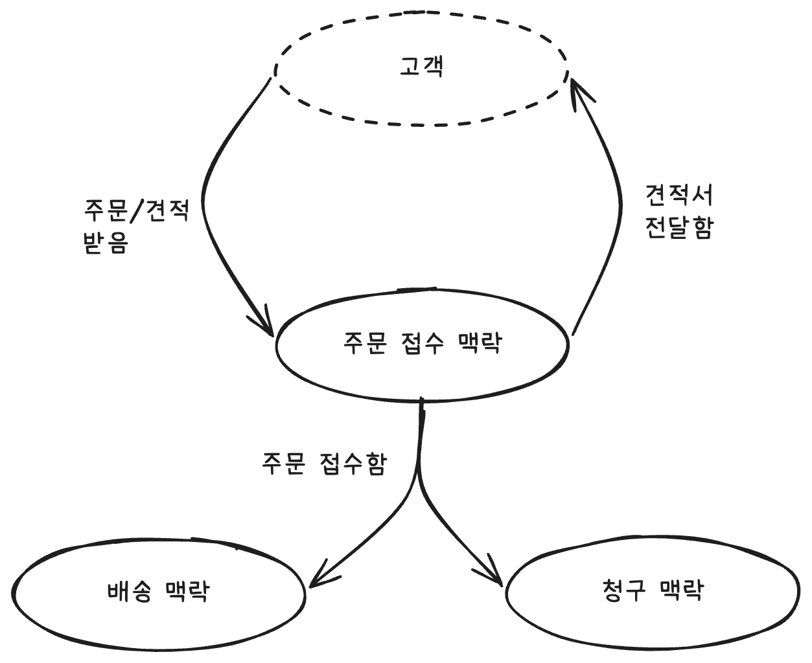
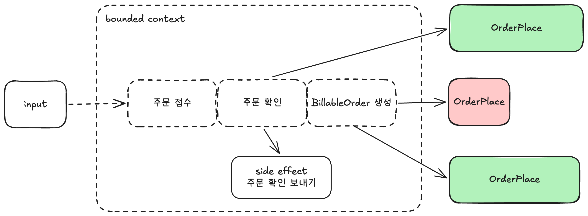

## 도메인 설계의 중요성

- 개발자와 도메인 전문가가 서로 다르게 문제를 이해하면 프로젝트를 성공적으로 수행하기 어려워 짐
    - 애자일 개발 프로세스 : 개발자와 도메인 전문가가 지속적으로 피드백을 주고 받음
    - 하지만 이 역시 용어의 번역 과정에서 오해가 발생할 여지가 많음
- 도메인 전문가, 개발자, 소스 코드까지 모두 동일한 모델을 사용하여 디자인 하는 것을 '도메인 주도 설계' 라고 함

## 도메인 주도 설계의 지침

- 자료구조보다 비즈니스 이벤트와 작업 흐름에 집중하라
- 문제 도메인을 더 작은 하위 도메인들로 나누어라
- solution 에 각 하위 도메인별 모델을 만들어라
- 공용어(ubiquitous language) 라 부르는 공용 언어를 개발하여 프로젝트 참여자 모두가 공유하고 코드 모든 곳에서 활용해라

하나의 예시를 통해 흐름 파악하기

> 이벤트 스토밍(event storming) : 비즈니스 이벤트와 이벤트가 수반하는 작업 흐름을 찾기 위한 브레인스토밍

예시는 주문 접수 시스템이다. 이벤트 스토밍을 통해 다음 이벤트들을 탐색한다.

- 주문서 받음
- 주문 접수함
- 주문 배송함
- 주문 변경 요청함
- 주문 취소 요청함
- 환불 요청함
- 견적서 받음
- 견적 발행함
- 신규 고객 등록 요청함
- 신규 고객 등록함

해당 과정에서 주의해야할 점들은 다음과 같다.

- 각 이벤트들의 빈틈을 계속 찾아야 한다
- 이벤트들을 시간순으로 배치해보면, 어느 팀의 출력이 어느 팀의 입력이 되는지(pipeline) 파악하기 쉬워지고 이를 명확하게 구별한다
- 해당 과정에서 기술적 고려는 신경쓰지 않는다

다음 명령을 문서화 해야한다.

> 명령이란 '이 도메인 이벤트들이 일어나게 한 것' 같은 요청들을 의미

- 이벤트 -> 명령 -> 비즈니스 작업 -> 출력 이벤트 -> 명령 ... 의 흐름을 문서화 하기

다음 하위 도메인으로 더욱 분리한다

> 도메인이란 일관된 지식의 영역이라는 정의지만, 더 이해하기 쉽게 도메인이란 도메인 전문가가 전문적으로 다루는 영역이다. 자바스크립트 개발자라면 자바스크립트 영역, 리엑트 개발자라면 리엑트의 영역

도메인은 도메인의 영역을 가지고 있는데, 이러한 영역들은 서로 겹치는 부분도 존재한다. css 의 경우 웹 프로그래밍 영역이자 웹 디자인 영역이기도 하다. 실생활에서는 다들 약간씩 겹쳐있긴 하다. 그럼에도 최대한 분리하는것이 핵심

다음 bounded context 를 설정하는데, 이는 실세계의 문제 영역 (주문 접수 시스템) 에 대한 해결책 세계에서 제시하는 모델의 공간을 의미한다. 

앞서 예시한 주문 접수 시스템에 관련된 주문 접수 맥락, 배송 맥락, 청구 맥락 들이 하나로 bounded context 에 묶여 있다. 이렇게 맥락을 설정해야 언어의 의미를 통일시킬 수 있다. '배' 라는 단어는 맥락이 무엇이냐에 따라 의미가 달라지기 때문이다. 또한 개발 환경에서는 이렇게 bounded context 가 명확할 수록 의존성을 컨트롤할 수 있고, 서로간의 약속된 interface 기반으로 소통이 가능해 서로간의 간섭을 최소화 할 수 있다. 

맥락에 대한 주의점과 참고사항은 다음과 같다.

1. 맥락 바로잡기
    - 도메인 전문가의 말에 귀 기울이기
    - 기존 팀 및 팀 경계에 주의하기
    - 경계 진 맥락의 '경계 진' 이란 말을 명심하기
    - 자율성을 염두에 둔 디자인
    - 막힘없는 비즈니스 작업 흐름 디자인 하기
2. 맥락 지도 만들기
    - 전체 시스템을 한눈에 볼 수 있게 한다. 
    -  
3. 가장 중요한 맥락에 집중하기
    - 핵심 도메인 : 핵심 도메인 예) 주문 접수 및 배송 도메인
    - 보조 도메인 : 핵심까지는 아님 예) 청구 도메인
    - 일반 도메인 : 특정 비즈니스에만 있는 것이 아닌 경우 예) 배송 도메인

이 다음 공용어를 만들어야 한다. 이 공용어는 어디에서나 사용이 가능해야 한다.

- 예로 주문은 Order 로 모든 팀이 해당 용어를 공용어로서 인식할 수 있어야 한다
- OrderManager 는 소스 코드상에서는 필요하겠지만, 디자인 설계 내 포함되어서는 안된다

## 도메인 이해하기

도메인 주도 설계를 할 때 주의할점

- 데이터베이스 중심 디자인 지양하기
- 클래스 중심 디자인 지양하기
- 너무 기술적인 문제에 초점을 맞추는것이 아니라 돈을 벌거나 절약하는 것에 집중
- 몇 시간의 계획이 몇 주간의 프로그래밍을 아낄 수 있기에 더욱 신중하게 도메인 전문가의 말을 귀담아 듣는다
- 

우선이 되어야 하는 점은 도메인이 디자인을 주도해야 하기에, 도메인을 파악하는것을 우선화 한다.

이러한 파악 과정을 문서화 하는 방식도 고려해본다.

- 작업 흐름은 입력과 출력을 문서화하고 간단한 의사코드로 비즈니스 로직을 표현한다
- 데이터 구조의 AND 는 둘 다 필요하다는 것을, OR 은 둘 중 하나만 필요하다는 것을 의미
- 공용어를 규칙에 기반해 명확히 정의한다
- 요구사항에 따른 특정 데이터의 제한사항도 명시적으로 표현한다
- 디자인에도 생애 주기가 있기에 이를 반영해야 한다

적용된 예시 문서화

**주의사항:** 

- 이 단계에서는 구현 세부사항, 클래스, 메서드, 함수 등을 고려하지 않습니다.
- 도메인 전문가와 개발자 모두 이해할 수 있는 자연어 기반의 문서화가 핵심입니다.
- `AND`, `OR`, `NOT`, `list of`, `??` 등의 표기만으로 충분하며, 주석 등으로 보충합니다.

```
# 초기 version 1

Bounded context: Order-taking

# 주문 배치 작업 흐름
Workflow: Place order
    triggered by:
        'Order form received' event (when Quote is not checked)
    primary input:
        An order form
    orther input:
        Product catalog
    output events:
        'Order Placed' event
    side-effects:
        An acknowledgement is sent to the customer,
        along with the placed order

# 데이터 구조
data Order = 
    CustomerInfo
    AND ShippingAddress
    AND BillingAddress
    AND list of OrderLines
    AND AmountToBill

data OrderLine =
    Product
    AND Quantity
    AND Price

data CustomerInfo = ???
data BillingAddres = ???
```

```
# version 2 (세부항목 추가)

Bounded context: Order-taking

data ProductCode = WidgetCode OR GizmoCode
data WidgetCode = string starting with 'W' then 4 digits
data GizmoCode = string starting with 'G' then 4 digits and not start with 'G0000'

data OrderQuantity = UnitQuantity OR KilogramQuantity
data UnitQuantity = 1..999
data KilogramQuantity = 100..20000

data UnvalidatedOrder = 
    UnvalidatedCustomerInfo
    AND UnvalidatedShippingAddress
    AND UnvalidatedBillingAddress
    AND list of UnvalidatedOrderLine

data UnvalidatedOrderLine = 
    UnvalidatedProductCode
    AND UnalidatedOrderQuantity

data ValidatedOrder = 
    ValidatedCustomerInfo
    AND ValidatedShippingAddress
    AND ValidatedBillingAddress
    AND list of ValidatedOrderLine
data ValidatedOrderLine = 

workflow 'Place Order' = 
    input : UnvalidatedOrder
    output (on success) :
        OrderAcknowledgement
        AND OrderPlaced (to send to shipping)
        AND BillableOrderPlaced (to send to billing)
    output (on error) :
        ValidationError

    // step 1
    do ValidateOrder
    If order is invalid then:
        return with ValidationError

    // step 2
    do PriceOrder

    // step 3
    do SendAcknowledgmentToCustomer

    // step 4
    return OrderPlaced event (if no errors)
```
```
Bounded context: Order-taking

substep 'ValidateOrder' = 
    input: UnvalidatedOrder
    output: ValidatedOrder OR ValidationError
    dependencies: CheckProductCodeExists, CheckAddressExists

    validate the customer name
    check that the shipping and billing address exist
    for each line:
        check product code syntax
        check that product code exists in ProductCatalog

    if everything is OK, then:
        return ValidatedOrder
    else:
        return ValidationError

substep 'PriceOrder' = 
    input: ValidatedOrder
    output: PricedOrder
    dependencies: GetProductPrice

    for each line:
        get the price for the product
        set the price for the line
    set the amount to bill ( = sum of the line prices )

substep 'SendAcknowledgmentToCustomer' = 
    input: PricedOrder
    output: None

    create acknowledgment letter and send it
    and the priced order to the customer
```

## 도메인 문서를 실제 소프트웨어 아키텍쳐에 적용시키기

위 도메인 문서까지 도메인 전문가와 함꼐 계속된 토론을 통해 완성하였다면, 이제 실제 소프트웨어 내 도메인 모델을 적용하기 위한 전체적인 뼈대를 구축해야 한다.

기본적으로 소프트웨어 아키텍쳐는 4가지 계층으로 이루어진다

- 시스템 맥락은 최상위 레벨로 전체 시스템을 나타낸다.
- 시스템 맥락은 웹사이트, 웹서비스, 데이터베이스 등과 같은 배포 단위인 '컨테이너'로 구성되어진다.
- 개별 컨테이너는 코드를 구성하는 주요소인 '컴포넌트' 들로 이루어진다
- 각 컴포넌트는 일련의 저수준 메서드나 함수를 포함하는 '클래스 혹은 모듈' 로 이루어진다

> 좋은 아키텍쳐의 목표는 컨테이너, 컴포넌트, 모듈 간 다양한 경계를 정의하며, 새로운 요구사항이 발생할 때에 따른 '변경 비용' 을 최소화 하는 것

### bounded context 기반 설계

- 각 bounded context 간 별로 컨테이너를 가지는 것이 모놀라식 설계(서비스 지향)
- 각 개별적 '작업 흐름' 기반으로 독립형 컨테이너를 만드는 것이 마이크로 서비스 아키텍쳐
- 초기에는 해당 경계를 명확하게 알기 어려우니 모놀리식을 통한 설계 이후 리팩토링이 좋음
- bounded context 간의 소통은 각 맥락들이 자율성을 가지기 위해서는, 오직 이벤트를 통해서만 연락해야한다.
- 각 맥락간의 데이터 전송은 데이터 전송 객체(DTO) 기반으로 처리한다


위 dto 를 설정하는 과정에서 관계를 맺는 양측 맥락간의 주도권을 누가 가지고 있는지에 따라 설계 주도권이 다르게 작용하게 된다.

- 공유 커널 : 양측 맥락이 서로 합의하에 DTO 설정
- 소비자 주도 계약 : 하위 맥락 (청구) 에서 '고객에 청구하기 위해 필요한 정보'를 정함 -> 주문 접수 맥락에서 이에 맞게 데이터를 전달 
- 순응 : 상위 맥락(제품 카탈로그)에서 정의한 계약에 따라 -> 하위 맥락(주문 접수)가 제품 코드를 맞춰 사용

맥락 내 작업 흐름의 경우 함수형 프로그래밍에서는 어떠한 이벤트 발생 시 이러한 이벤트를 리스너로 받고, 이에 따른 새로운 이벤트를 출력하는 방식이 아니라, pipeline 내 함수를 연결 시켜줌으로서 리스너 의존성을 가지지 않도록 하는것을 좋은 설계로 본다. 아래 그림 참조



마지막으로 아키텍쳐를 설정할 때, 클린 아키텍쳐 기반으로 도메인 코드를 가장 중심에 두고, 이러한 도메인을 외부 계층(서비스, 인터페이스, 데이터베이스 등)이 감싸는 구조가 좋다.

도메인은 외부를 의존하지 않도록 하는것이 포인트


